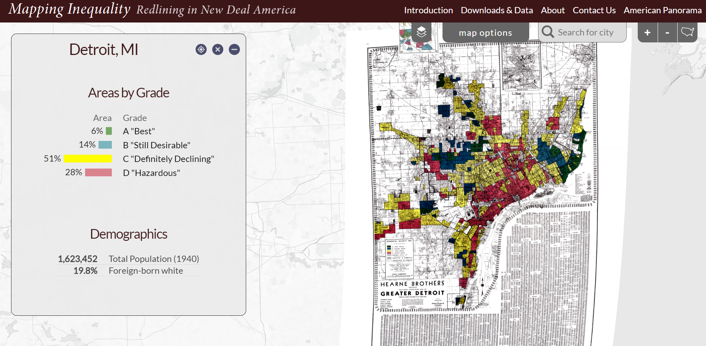
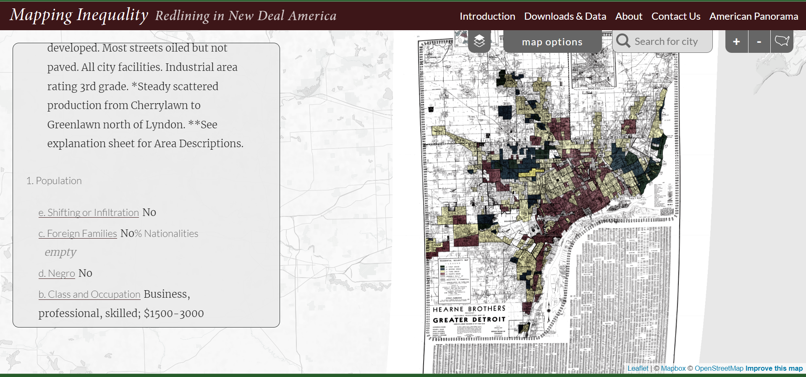

## Source

[Digital Scholarship Lab. Mapping Inequality. Accessed October 4, 2022.](https://dsl.richmond.edu/panorama/redlining/#loc=4/38.382/-97.194.)

## Evaluation

The "Mapping Inequality, Redlining in New Deal America" DH project is born out of University of Richmond's Digital Scholarship Lab, with collaborations from four other institutions: Virginia Tech, University of Maryland, and Johns Hopkins University. 

The project asks the hard-hitting question of "how can a digital mapping project include and pick up Black perspective in this period of American History known for systemic racism and discrimmination." Combining map composites and datasets as well as textual evidence, this project encourages its users to grapple with the history and reality of redlinning in America, and how traces of it can still be found today. 

Users can zoom in and out of the U.S. map on the site, and click on major cities with various gradings used by the government to enforce redlining. For each city, the site provides an ArcGis map of the sity color coded by the zones prescribed by the government for redlining purposes. Each zone is also interactive as it provides a close up as well as actual descriptions used by the government to explain the grading by geographic proximities, racial demographic, and other scales: 

Below the textual descriptions are also population demographic data, such as occupation, family information, and class:

With this tool, users can investigate what specific scales contributed to redlining in the U.S., as well as clear evidence for demographics' influence on those gradings. 

Some technologies used in this project include ArcGis for mapping, [leaflet](https://leafletjs.com/), Polygons, and GeoJSON. 

The overall panorama map and specific zoomed in city maps in this project provide a comprehensive experience in research and education, as it both visualizes and matches them with textual support. The population data working alongside with actual color grading from the government for redlining allows for both simple and complex research. 
