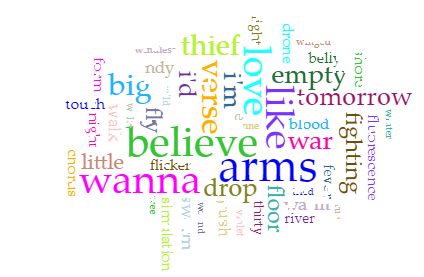
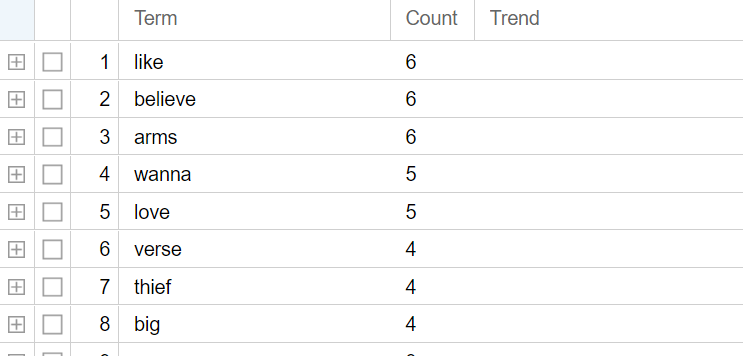
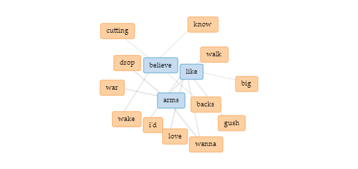
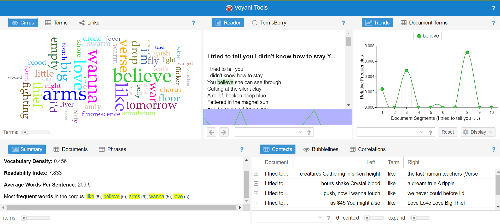

## Source
[Voyant Tools. Voyant Tools. Accessed November 29, 2022.](https://voyant-tools.org/)

## Evaluation 
Voyant Tools is a "web-based reading and analysis environment for digital texts," in other words, it is a tool that uses Natural Language Processing for digital humanists. This tool takes digital texts and produces a visual collage of key words with various weights and sizes based on their frequencies. 

Developers Stéfan Sinclair of Canadian Society for Digital Humanities and Geoffrey Rockwell of University of Alberta are responsible for the creation and maintenous of the site. 

The goal of Voyant Tools is to show the user analysis of their corpus based on word frequencies through the word collage and other data visualizations:

 
*This is the sample word cloud of Big Thief's song Simulation Swarm lyrics with Voyant Tools. 

On top of that, Voyant Tools answers the questions like what are the most common words in the corpus, and their frequencies in relation to the other common words in tabular form: 

 
*This is the table of the word frequncies in the song lyrics. 

With its other function called "Links," Voyant Tools provides a visual representation of word associations in the corpus, showing the user how key words are used: 

This function within Voyant Tools can be used to answer questions of contexts in which the words are used, and which words are related to each other and such. 

Voyant Tools uses the technology of NLP as well as webscraping for it supports users to upload URLs for their corpora. Once it scrapes all the texts from the website, it then uses NLP to analyze the texts and their frequencies like we've done in class with project Gutenberg and Gibbon. 

The strengths of Voyant Tools is certainly in its simplicit interface and easiness to produce a simple word cloud. It also has a range of different tools and presentations of the NLP data gathered from texts corpus, which makes it versatile. 

However, once the user advances past the initial page, the interface with its variety of tools is a bit cluttered and might induce anxiety or confusion:

The site also sacrifices other critical information like a traditional about page for its simplicity, which makes further scholarship on it harder. It's basic/easy to follow steps also means it can only provide those straight forward analysis such as frequency and link, as well as trends with the graph. Any further scholarship beyond that requires either more tools, more knowledge, or both. 