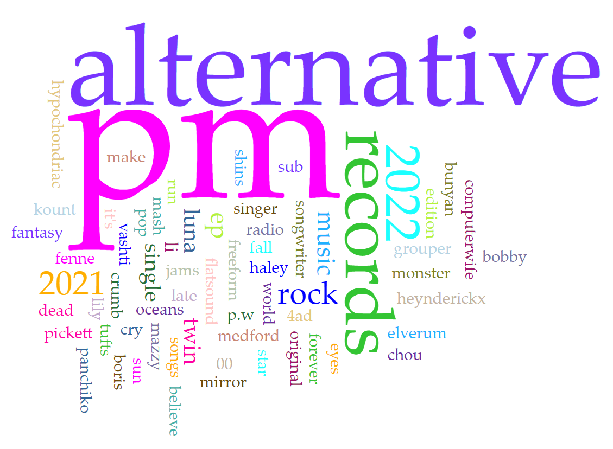

# On NLP and Voyant tools

This week's reading probably is the one that had the most impact on me thus far into the course. Before this, I had only heard of NLP from other DH professors and classmates, and the term always seemed so distant in terms of skill level and complexity. 

However, after this introductory piece on Natural Language Processing, especially the Chinese Room analogy helped de-mystify this process whilst also adding another layer of familiarity to it since my first language is indeed Mandarin Chinese. 

The plain terms and easy to follow example dissected NLP to the steps of converting naturally developed human language into patterns and rules computers can follow to manipulate the text corpus. 

In conjunction to the NLP reading, Voyan Tools served as an example to the types of manipulation a computer can do. When I was experimenting with it, I used my college radio (WMFO) playlist from last week to see if there's any patterns in the tracks I played. The results were interesting, as Voyant was able to pick up the genre from my playlist website, thus making "Alternative" one of the biggest words in the word cloud. Beyond that, I found the almost equal distribution of artist names ranging from first to last name also interesting, since I couldn't decipher a clear pattern over how Voyant chose to present them. 

